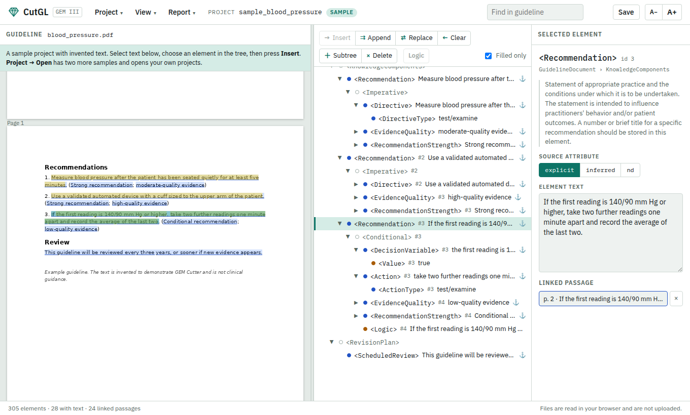

# CutGL — Cutter for Guidelines

GEM Cutter III online: view a clinical guideline marked up as a Guideline Elements Model
(GEM III, ASTM E2210) XML document, side by side with the guideline it was cut from, and
mark up new ones.

There is nothing to install, and the guideline and your markup never leave the browser.

GEM Cutter III is a Java desktop application from the Yale Center for Medical Informatics
(2012). CutGL is a port of it to a static web page. It opens GEM XML files and project
folders made with the desktop application, saves projects the desktop application can open,
and produces the same GEM XML and the same six reports.



## Viewing a GEM XML

Drop a GEM `.xml` file on the page, or use **Project → Open → Choose .zip or .xml**. The
element tree shows the document with each element's definition from the GEM III schema;
**Filled only** hides the empty elements, and the **Report** menu gives the original
Recommendations, Detailed, Rules, Decision Variables, Actions and GEM-COGS views. Attach the
guideline the document was cut from, and **Link element text to passages** finds the text of
each element in it and highlights the passages.

## What it does

### Bring a guideline

- **New project** from a guideline in PDF, HTML, RTF, Word `.docx` or plain text. The tree
  starts as the full GEM III schema, every element once.
- **Open a desktop project.** Choose the project folder (the one that holds `resources/`),
  a zip of it, or drop either on the page. The tree comes from `GEMCutterTreeModel.xml` and
  the passage links from `linkbean`.
- **Open a GEM XML file** on its own, then attach the guideline document.
- **GEM II ⇒ GEM III** adds every element the GEM III schema defines that the document
  lacks, in schema order.
- **Three sample projects** with invented guidelines, one each in plain text, HTML and PDF
  (Project → Open). The same three are in [`demo/`](demo/) as project folders.

### Mark it up

- **Insert, Append, Replace, Clear** move the text selected in the guideline into the
  selected element, as in the desktop application. Text taken from the guideline is marked
  `explicit`; text you type is marked `inferred`; you can also set the source by hand.
- **Passage links.** Every element remembers where its text came from. Linked passages are
  underlined in the guideline, passages used by more than one element are yellow, and
  clicking a passage selects its element. This works in PDFs too, where the desktop
  application kept no record.
- **Link element text to passages** searches the guideline for the text of elements that
  have no link, for one element or the whole tree. It is how a desktop PDF project gets its
  highlights back.
- **Subtree and Delete** add or remove another copy of an element with its children. New
  copies take the next free `id` for each element name.
- **Code sets** on every `…Code` element, **types** from the fixed list on `ActionType` and
  `DirectiveType`, and drag and drop for `Conditional` and `Imperative` elements.
- **Logic window** for Conditional and Imperative recommendations: If and Then panes,
  `( ) AND OR NOT`, and the decision variables and actions to click into place.
- **Find** in the guideline ignores case, spacing, line breaks and hyphens, so a phrase is
  found even where a PDF wraps it. **Filled only** hides the empty elements of the tree.

### Get the results out

- **Save project** downloads a zip in the desktop layout: the GEM XML, the tree model, the
  properties file, the guideline, and one extra file with the passage links. Unzipped next
  to `GemCutter.jar`, it opens in the desktop application.
- **Export GEM XML** and **View XML** give the document in the layout the desktop
  application writes.
- **Reports:** Recommendations, Detailed, Rules, Decision Variables, Actions and GEM-COGS,
  produced by the original XSLT stylesheets. Save one as HTML, print it, or run it with
  your own modified stylesheet (Custom XSL). Browsers are removing XSLT; where it is gone,
  the page loads a replacement engine (libxslt compiled to WebAssembly) and the reports
  come out the same.
- **Kept in the browser.** The project you are working on is stored in this browser as you
  go and is there when you come back. The zip from Save is the copy to keep.

## Where it differs from the desktop application

- Passage links are kept for PDF guidelines, and for text added with Append.
- Typing in an element marks it `inferred`; the desktop application did so as soon as the
  text box was clicked.
- Clear also sets the source back to `nd`.
- A hyphen at a line break is joined, and other line breaks become spaces, whatever the
  line ending. The desktop application did this only for Windows line endings.
- New subtrees take the highest `id` in use for that element name plus one. The desktop
  application counted from the start of each session, so ids could repeat after a restart.
- GEM II ⇒ GEM III completes the tree from the schema instead of a fixed list of elements.
- Word `.docx` guidelines are accepted. Old `.doc` files are not.
- Projects live in the browser's storage and in the zip you save, not in a folder beside
  the program.

## AI integration (planned)

A later stage will let a model propose the GEM III markup of a guideline, as GEM XML, for a
person to review here: each element linked to its passage, so that what the model copied,
reworded or left out is visible beside the source. The review tools that needs are the ones
above; the parser itself is not built yet.

## Run it locally

A static page with no build step.

```bash
python3 -m http.server 8000     # or: npm run serve
# open http://localhost:8000
```

Opening `index.html` straight from disk also works. The libraries the page needs
(PDF.js for PDF guidelines, JSZip for zips, mammoth for `.docx`, and the XSLT replacement)
load from a CDN the first time each is needed, so those features need a connection.
To host it, serve the repository root; with GitHub Pages, publish from `main`.

## Tests

```bash
npm install
npx playwright install chromium   # once
npm test
```

The tests drive the real page in headless Chromium, with the CDN libraries answered from
`node_modules`. They cover the samples and demo folders, projects in the desktop formats,
the six reports with both XSLT engines, tree editing, the logic window, taking text from a
PDF, search, and narrow screens.

Everything under `tests/fixtures/` and `demo/` is generated from invented text:

```bash
npm run demo                       # demo/ folders from src/samples.js (and the sample PDF)
python3 scripts/make_report_refs.py   # reference report text, with libxslt (needs lxml)
# scripts/java/MakeFixture.java     desktop-format fixtures, written with the JDK's own classes
```

The port was also checked against a real desktop project that is not in this repository:
its exported XML was identical, character for character, to the file the desktop
application had written.

## Your own projects

Nothing you open is added to the repository: projects stay in your browser and in the
zips you save. If you want project folders beside the code, put them in `local/`, which is
git-ignored.

## Layout

```
index.html            the page
src/core.js           document model, GEM III schema, GEM XML, desktop tree model, RTF, sanitising
src/javaser.js        reader for Java-serialised files (the desktop "linkbean")
src/app.js            the interface: tree, guideline pane, passage links, reports, projects
src/samples.js        the three sample projects
src/sample_pdf.js     the PDF sample's guideline (generated)
src/resources.js      GEM III schema and report stylesheets as one script (generated)
src/styles.css        light and dark themes
third_party/          the schema and stylesheets from GEM Cutter III, unchanged
demo/                 the sample projects as desktop project folders
tests/                Playwright tests and generated fixtures
scripts/              generators for resources, demos, fixtures, the screenshot; single-file bundle
docs/                 file formats, screenshot
local/                your own projects (git-ignored)
```

The formats the page reads and writes are described in [docs/formats.md](docs/formats.md).

## Credits and license

- **GEM Cutter III** and the Guideline Elements Model are the work of the Yale Center for
  Medical Informatics. The GEM III schema and the six report stylesheets in
  [`third_party/gem-cutter-iii/`](third_party/gem-cutter-iii/) come unchanged from the
  GEM Cutter III distribution and remain their authors'; see the
  [notice](third_party/gem-cutter-iii/NOTICE.md) there. `src/resources.js` is a generated
  copy of the same files.
- CutGL was re-implemented in JavaScript from the behaviour and file formats of the
  desktop application, worked out by studying its compiled program. None of its Java code
  is included. It was written with Claude (Anthropic).
- The sample guidelines are invented and are not clinical guidance.
- Everything else is under the [MIT License](LICENSE).
